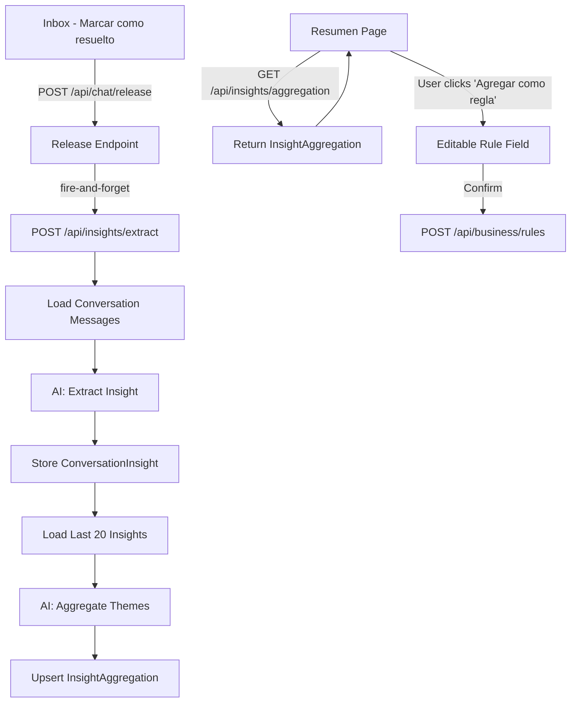
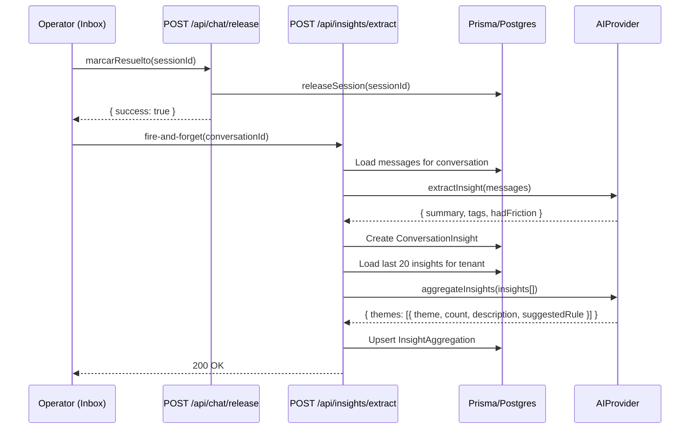
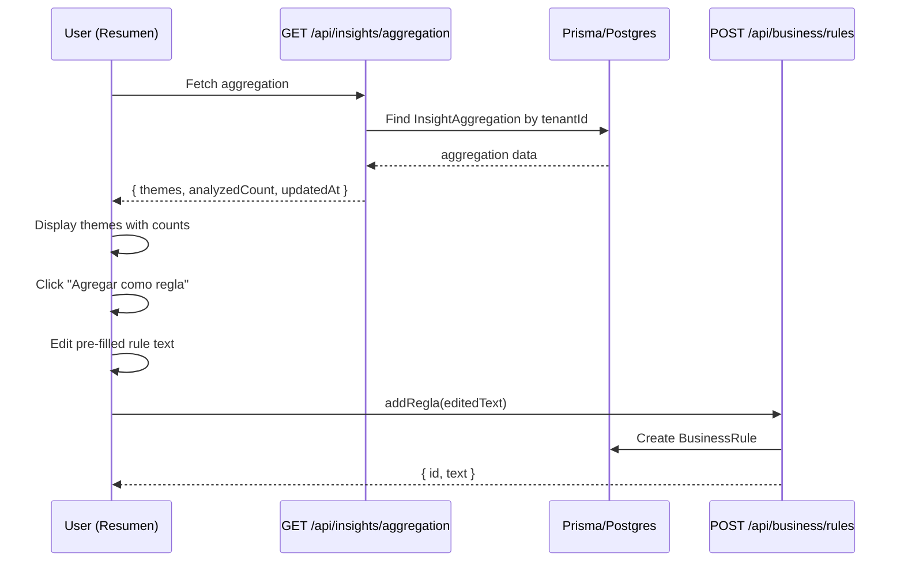

# Design Document: Conversation Insights & Rule Suggestions

## Overview

When a conversation is marked as "resuelto" (status transitions to `completado`), an AI call extracts a friction/insight summary from the conversation messages. After each extraction, an aggregation AI call analyzes the last 20 insights for the tenant and generates suggested business rules. The Resumen page displays these aggregated insights with one-click (editable) rule suggestions, enabling Rimay to learn from customer interactions and surface actionable business rules.

This feature differentiates Rimay from static chatbots by providing a feedback loop: conversations → insights → suggested rules → better AI responses.

## Architecture



## Sequence Diagrams

### Insight Extraction Flow



### Resumen Page Flow



## Components and Interfaces

### Component 1: Insight Extraction AI Prompt

**Purpose**: Analyzes a completed conversation's messages and produces a structured insight summary.

**Interface**:
```typescript
type InsightExtractionInput = {
  messages: { role: "cliente" | "agente" | "operador"; content: string }[];
  businessName: string;
  rubro: string;
};

type InsightExtractionOutput = {
  summary: string;       // 1-2 sentence summary of the conversation outcome
  tags: string[];        // e.g. ["demora", "precio", "disponibilidad"]
  hadFriction: boolean;  // true if customer experienced friction/frustration
};
```

**Responsibilities**:
- Analyze conversation tone and outcomes
- Identify friction points (complaints, confusion, escalation triggers)
- Produce concise, actionable tags for aggregation
- Never hallucinate—base summary purely on message content

### Component 2: Insight Aggregation AI Prompt

**Purpose**: Analyzes a batch of recent insights and produces themed groupings with suggested rules.

**Interface**:
```typescript
type AggregationInput = {
  insights: { summary: string; tags: string[]; hadFriction: boolean }[];
  existingRules: string[];  // to avoid suggesting duplicates
  businessName: string;
  rubro: string;
};

type AggregationTheme = {
  theme: string;           // e.g. "Consultas sobre disponibilidad de platos"
  count: number;           // how many insights match this theme
  description: string;     // brief explanation of the pattern
  suggestedRule: string;   // pre-filled rule text ready for the owner
};

type AggregationOutput = {
  themes: AggregationTheme[];  // max 5 themes, sorted by count desc
};
```

**Responsibilities**:
- Cluster insights into meaningful business themes
- Count occurrences per theme across the insight window
- Generate specific, actionable rule text (not vague)
- Avoid suggesting rules that duplicate existing business rules
- Max 5 themes to keep the UI focused

### Component 3: Extract API Route

**Purpose**: Orchestrates the extraction + aggregation pipeline.

**Interface**:
```typescript
// POST /api/insights/extract
// Request body:
type ExtractRequest = {
  conversationId: string;
};

// Response:
type ExtractResponse = {
  insight: { id: string; summary: string; tags: string[]; hadFriction: boolean };
  aggregationUpdated: boolean;
};
```

**Responsibilities**:
- Validate session and conversation ownership
- Load conversation messages from DB
- Call AI extraction prompt
- Store `ConversationInsight`
- Load last 20 insights for tenant
- Call AI aggregation prompt
- Upsert `InsightAggregation`
- Handle errors gracefully (log, don't crash caller)

### Component 4: Aggregation API Route

**Purpose**: Serves the current aggregation data for the Resumen page.

**Interface**:
```typescript
// GET /api/insights/aggregation
// Response:
type AggregationResponse = {
  themes: AggregationTheme[];
  analyzedCount: number;
  updatedAt: string;  // ISO date
} | null;  // null if no aggregation exists yet
```

**Responsibilities**:
- Validate session
- Return the latest `InsightAggregation` for the tenant
- Return null if no insights have been processed yet

### Component 5: Resumen Page - Insights Section

**Purpose**: Displays aggregated insights with actionable rule suggestions.

**Interface**:
```typescript
type InsightsSectionProps = {
  themes: AggregationTheme[];
  analyzedCount: number;
  updatedAt: string;
  onAddRule: (text: string) => void;
};
```

**Responsibilities**:
- Fetch aggregation data on mount
- Display themes in a visually distinct section (violet/purple accent)
- Show theme name, count, and description
- "Agregar como regla" button per theme → editable text field
- Pre-fill with `suggestedRule` text
- On confirm, call `addRegla(text)` from BusinessContext
- Handle empty state (no insights yet)

## Data Models

### ConversationInsight

```typescript
// Prisma model
model ConversationInsight {
  id             String   @id @default(uuid())
  conversationId String   @unique @map("conversation_id")
  tenantId       String   @map("tenant_id")
  summary        String
  tags           Json     // string[]
  hadFriction    Boolean  @default(false) @map("had_friction")
  createdAt      DateTime @default(now()) @map("created_at")

  conversation Conversation @relation(fields: [conversationId], references: [id], onDelete: Cascade)
  tenant       Tenant       @relation(fields: [tenantId], references: [id], onDelete: Cascade)

  @@index([tenantId, createdAt])
  @@map("conversation_insights")
}
```

**Validation Rules**:
- `conversationId` must reference an existing conversation with status `completado`
- `summary` must be non-empty, max 500 chars
- `tags` must be a JSON array of strings, max 10 tags
- One insight per conversation (unique constraint on `conversationId`)

### InsightAggregation

```typescript
// Prisma model
model InsightAggregation {
  id            String   @id @default(uuid())
  tenantId      String   @unique @map("tenant_id")
  themes        Json     // AggregationTheme[]
  analyzedCount Int      @default(0) @map("analyzed_count")
  createdAt     DateTime @default(now()) @map("created_at")
  updatedAt     DateTime @updatedAt @map("updated_at")

  tenant Tenant @relation(fields: [tenantId], references: [id], onDelete: Cascade)

  @@map("insight_aggregations")
}
```

**Validation Rules**:
- One aggregation per tenant (unique constraint on `tenantId`)
- `themes` is a JSON array of `AggregationTheme` objects, max 5
- `analyzedCount` tracks how many insights contributed to this aggregation

## Key Functions with Formal Specifications

### Function 1: extractConversationInsight()

```typescript
async function extractConversationInsight(
  conversationId: string,
  tenantId: string
): Promise<InsightExtractionOutput>
```

**Preconditions:**
- `conversationId` references a valid conversation with status `completado`
- Conversation belongs to `tenantId`
- Conversation has at least 1 message

**Postconditions:**
- Returns a valid `InsightExtractionOutput` with non-empty summary
- `tags` array contains 1-10 strings
- No side effects on the conversation or messages

### Function 2: aggregateInsights()

```typescript
async function aggregateInsights(
  tenantId: string
): Promise<AggregationOutput>
```

**Preconditions:**
- At least 1 `ConversationInsight` exists for the tenant

**Postconditions:**
- Returns `AggregationOutput` with 1-5 themes
- Each theme has `count >= 1`
- Themes are sorted by count descending
- `suggestedRule` text is non-empty and actionable
- Does not duplicate existing business rules

### Function 3: handleInsightExtraction()

```typescript
async function handleInsightExtraction(
  conversationId: string,
  tenantId: string
): Promise<{ insight: ConversationInsight; aggregationUpdated: boolean }>
```

**Preconditions:**
- Valid session with matching `tenantId`
- `conversationId` is a valid UUID
- Conversation exists and belongs to tenant

**Postconditions:**
- `ConversationInsight` record created in DB
- If tenant has insights, `InsightAggregation` is upserted
- Returns the created insight and whether aggregation was updated
- If AI fails, throws with descriptive error (caller handles gracefully)

## Example Usage

```typescript
// 1. Inbox triggers extraction after marking conversation as resolved
async function marcarResuelto(id: string) {
  // First, release the conversation (existing flow)
  await fetch("/api/chat/release", {
    method: "POST",
    headers: { "Content-Type": "application/json" },
    body: JSON.stringify({ sessionId: id }),
  });

  // Fire-and-forget: extract insight
  fetch("/api/insights/extract", {
    method: "POST",
    headers: { "Content-Type": "application/json" },
    body: JSON.stringify({ conversationId: id }),
  }).catch(console.error); // don't block UI
}

// 2. Resumen page fetches aggregation
const res = await fetch("/api/insights/aggregation");
const data: AggregationResponse = await res.json();

if (data) {
  // Render themes
  data.themes.forEach(theme => {
    console.log(`${theme.theme} (${theme.count}x): ${theme.description}`);
    console.log(`  Regla sugerida: ${theme.suggestedRule}`);
  });
}

// 3. User accepts a suggested rule (editable)
const editedRule = "No aceptamos pedidos después de las 10 PM";
addRegla(editedRule); // existing BusinessContext method
```

## Error Handling

### Error Scenario 1: AI Provider Fails During Extraction

**Condition**: The AI provider times out or returns an invalid response during insight extraction.
**Response**: Log the error, return HTTP 500 with descriptive message. The conversation remains `completado`—the insight is simply not generated.
**Recovery**: The next conversation close will trigger a new extraction. Missing insights don't corrupt the aggregation.

### Error Scenario 2: AI Provider Fails During Aggregation

**Condition**: Extraction succeeds but aggregation AI call fails.
**Response**: Store the insight anyway. Log aggregation failure. Return the insight with `aggregationUpdated: false`.
**Recovery**: Next extraction will re-run aggregation with all available insights (including the previously stored one).

### Error Scenario 3: Conversation Has No Messages

**Condition**: A conversation is marked as resolved but has no messages (edge case from data cleanup).
**Response**: Return HTTP 400 with message "La conversación no tiene mensajes para analizar."
**Recovery**: No action needed—no insight to extract.

### Error Scenario 4: Duplicate Extraction Attempt

**Condition**: The extract endpoint is called twice for the same conversation (e.g., double-click).
**Response**: If an insight already exists for that `conversationId` (unique constraint), return the existing insight without re-processing.
**Recovery**: Idempotent behavior—no data corruption.

## Testing Strategy

### Unit Testing Approach

- Test insight prompt builder produces valid prompt text
- Test aggregation prompt builder includes existing rules for deduplication
- Test JSON schema validation for extraction and aggregation outputs
- Test error handling: invalid conversation, no messages, duplicate extraction

### Property-Based Testing Approach

**Property Test Library**: fast-check

- Property: Extraction output schema is always valid for any non-empty message array
- Property: Aggregation output theme counts sum correctly and are sorted descending
- Property: Aggregation never suggests rules that duplicate existing rules

### Integration Testing Approach

- End-to-end: mark conversation resolved → verify insight created → verify aggregation updated
- Resumen page: fetch aggregation → verify UI renders themes correctly
- Rule acceptance: click "Agregar como regla" → verify rule appears in BusinessContext

## Performance Considerations

- **Fire-and-forget pattern**: The extraction call does not block the inbox UI. The user gets immediate feedback that the conversation is resolved.
- **Aggregation window**: Only the last 20 insights are analyzed, keeping the aggregation prompt small and fast.
- **Upsert pattern**: One aggregation record per tenant (not append-only), so reads are O(1).
- **AI timeout**: Reuse the existing 20s timeout from `lib/ai/engine.ts`. If extraction fails, don't retry automatically.

## Security Considerations

- **Tenant isolation**: Both API routes validate session and check `tenantId` ownership before processing.
- **No cross-tenant data leakage**: Insights and aggregations are strictly scoped by `tenantId`.
- **Input validation**: `conversationId` must be a valid UUID and belong to the authenticated tenant.
- **AI prompt injection**: Messages are passed as data to the AI, not as system prompt content. The extraction prompt clearly separates instructions from conversation data.

## Dependencies

- **Prisma**: New models `ConversationInsight` and `InsightAggregation` (migration required)
- **Existing AI infrastructure**: `getProvider()`, `AIProvider` interface (extended with new methods or called directly via prompt)
- **Existing BusinessContext**: `addRegla()` for rule creation from the UI
- **Existing release flow**: `POST /api/chat/release` as the trigger point

## Correctness Properties

*A property is a characteristic or behavior that should hold true across all valid executions of a system—essentially, a formal statement about what the system should do. Properties serve as the bridge between human-readable specifications and machine-verifiable correctness guarantees.*

### Property 1: Extraction produces valid structured output

For any non-empty array of conversation messages, the extraction function SHALL return an output with a non-empty summary (≤500 chars), 1-10 tags (each non-empty string), and a boolean `hadFriction` field.

**Validates: Requirements 1.2**

### Property 2: Aggregation themes are sorted by count descending

For any set of insights passed to the aggregation function, the output themes array SHALL be sorted such that `themes[i].count >= themes[i+1].count` for all valid indices.

**Validates: Requirements 2.2**

### Property 3: Aggregation never suggests duplicate rules

For any set of insights and existing business rules, the aggregation output's `suggestedRule` text for each theme SHALL NOT be identical to any existing rule in the tenant's rule set.

**Validates: Requirements 2.4**

### Property 4: Extraction is idempotent per conversation

For any conversation that already has a `ConversationInsight` record, calling the extract endpoint again SHALL return the existing insight without creating a duplicate or modifying the original.

**Validates: Requirements 1.4, 7.1**

### Property 5: Aggregation theme count consistency

For any aggregation output, the sum of all `theme.count` values SHALL be less than or equal to the total number of insights analyzed (≤20), and each `theme.count` SHALL be ≥ 1.

**Validates: Requirements 2.6**

### Property 6: Tenant isolation across endpoints

For any tenant, the Extract_Endpoint SHALL reject requests for conversations not owned by that tenant, and the Aggregation_Endpoint SHALL only return aggregation data belonging to the authenticated tenant.

**Validates: Requirements 6.1, 6.2**

### Property 7: Insight persistence round-trip

For any successfully extracted insight, storing it as a ConversationInsight and then retrieving it via the Aggregation_Endpoint (as part of the aggregation's source data) SHALL produce data consistent with the original extraction output.

**Validates: Requirements 1.3, 3.1**
